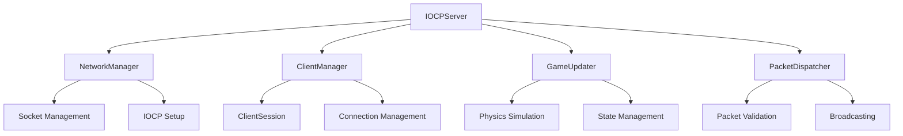

# IOCP 멀티플레이어 게임 서버

Windows IOCP(Input/Output Completion Port)를 사용한 고성능 멀티플레이어 게임 서버입니다. C++17으로 작성되었으며, Unreal Engine 클라이언트와의 호환성을 고려하여 설계되었습니다.

## 🎯 주요 기능

### 핵심 시스템
- **IOCP 기반 비동기 네트워킹**: Windows IOCP를 활용한 고성능 네트워크 처리
- **모듈화된 아키텍처**: 각 기능이 독립적인 클래스로 분리된 유지보수 용이한 구조
- **실시간 멀티플레이어**: 다중 클라이언트 동시 접속 및 실시간 동기화
- **물리 시뮬레이션**: 중력, 충돌 감지, 이동 처리 등 기본 물리 시스템

### 네트워크 기능
- **패킷 기반 통신**: 구조화된 패킷 시스템으로 안정적인 데이터 전송
- **연결 관리**: 자동 타임아웃 처리 및 Graceful 연결 종료
- **브로드캐스팅**: 효율적인 위치 정보 동기화
- **안티 치트**: 입력 검증 및 스팸 방지 시스템

### 게임 로직
- **플레이어 상태 관리**: IDLE, WALKING, RUNNING, JUMPING, ATTACKING 등
- **실시간 위치 동기화**: 최적화된 위치 업데이트 시스템
- **스폰 시스템**: 다중 스폰 포인트 지원
- **월드 경계**: 게임 월드 범위 제한

## 🏗️ 아키텍처

### 모듈 구조
```
IOCPServer (메인 컨트롤러)
├── NetworkManager (네트워크 관리)
├── ClientManager (클라이언트 세션 관리)
├── GameUpdater (게임 로직 처리)
├── PacketDispatcher (패킷 송수신)
├── NetworkSessionManager (세션 네트워크 처리)
└── Logger (로깅 시스템)
```

### 클래스 다이어그램


## 📦 패킷 시스템

### 지원 패킷 타입
- `CLIENT_ID`: 클라이언트 ID 할당
- `CONNECT/DISCONNECT`: 연결 관리
- `PING/PONG`: 연결 상태 확인
- `PLAYER_INIT_INFO`: 플레이어 초기화
- `PLAYER_INPUT_INFO`: 입력 정보
- `PLAYER_POSITION_INFO`: 위치 동기화

### 패킷 구조
```cpp
struct PacketHeader {
    uint16_t PacketSize;
    EPacketType PacketType;
};

struct InputPacket {
    PacketHeader Header;
    int32_t ClientId;
    float ForwardValue;     // -1.0 ~ 1.0
    float RightValue;       // -1.0 ~ 1.0
    float RotationPitch;    // -90.0 ~ 90.0
    float RotationYaw;      // -180.0 ~ 180.0
    float RotationRoll;     // -180.0 ~ 180.0
    bool bJumpPressed;
    bool bAttackPressed;
    bool bCrouchPressed;
    bool bRunPressed;
};
```

## 🛠️ 빌드 방법

### 요구사항
- **운영체제**: Windows 10/11 (64-bit)
- **컴파일러**: Visual Studio 2019/2022 또는 MinGW-w64
- **CMake**: 3.16 이상
- **Windows SDK**: 최신 버전

### Visual Studio 빌드
```bash
# 프로젝트 클론
git clone <repository-url>
cd IOCPServer

# CMake 빌드 디렉토리 생성
mkdir build
cd build

# CMake 구성 (Visual Studio 2022 예시)
cmake .. -G "Visual Studio 17 2022" -A x64

# 빌드
cmake --build . --config Release
```

### 명령행 빌드
```bash
# Release 빌드
mkdir build && cd build
cmake .. -DCMAKE_BUILD_TYPE=Release
cmake --build .

# Debug 빌드
cmake .. -DCMAKE_BUILD_TYPE=Debug
cmake --build .
```

## 🚀 사용법

### 기본 실행
```bash
# 기본 포트(9000)로 서버 시작
./IOCPServer.exe

# 커스텀 포트로 실행
./IOCPServer.exe --port 8080

# 로그 레벨 설정
./IOCPServer.exe --port 9000 --log DEBUG
```

### 명령행 옵션
- `-p, --port <포트번호>`: 서버 포트 설정 (기본값: 9000)
- `-l, --log <레벨>`: 로그 레벨 (DEBUG, INFO, WARNING, ERROR)
- `-h, --help`: 도움말 표시

### 서버 설정
주요 게임 설정값들:
```cpp
struct GameSettings {
    float moveSpeed = 500.0f;        // 기본 이동 속도
    float runMultiplier = 2.0f;      // 달리기 속도 배율
    float crouchMultiplier = 0.5f;   // 웅크리기 속도 배율
    float jumpVelocity = 600.0f;     // 점프 속도
    float gravity = 980.0f;          // 중력 가속도
    float groundLevel = 90.0f;       // 지면 높이
    float worldBoundary = 10000.0f;  // 월드 경계
};
```

## 🔧 클라이언트 연동

### Unreal Engine 연동 예시
```cpp
// 클라이언트 측 패킷 전송 예시
void SendInputToServer(float Forward, float Right, float Yaw) {
    InputPacket packet;
    packet.Header.PacketType = EPacketType::PLAYER_INPUT_INFO;
    packet.Header.PacketSize = sizeof(InputPacket);
    packet.ClientId = MyClientId;
    packet.ForwardValue = Forward;
    packet.RightValue = Right;
    packet.RotationYaw = Yaw;
    // ... 기타 필드 설정
    
    SendPacketToServer(&packet, sizeof(packet));
}
```

### 연결 흐름
1. **연결**: 클라이언트가 서버에 TCP 연결
2. **ID 할당**: 서버가 고유 클라이언트 ID 전송
3. **초기화**: 스폰 위치 및 초기 게임 상태 동기화
4. **게임 루프**: 입력 전송 → 서버 처리 → 위치 동기화
5. **연결 종료**: Graceful 또는 타임아웃 처리

## 📊 성능 특성

### 처리 능력
- **동시 접속**: 1,000+ 클라이언트 (하드웨어 의존)
- **서버 FPS**: 60Hz 업데이트 루프
- **패킷 처리**: 초당 수만 개 패킷 처리 가능
- **메모리 사용량**: 클라이언트당 약 1-2KB

### 최적화 기법
- **델타 압축**: 변화가 있을 때만 업데이트 전송
- **거리 기반 LOD**: 중요도에 따른 업데이트 주기 조절
- **메모리 풀링**: 빈번한 할당/해제 최소화
- **IOCP 워커 스레드**: CPU 코어 수에 맞춘 스레드 풀

## 🐛 디버깅 및 로깅

### 로그 시스템
```cpp
// 로그 레벨별 출력
LOG_DEBUG("디버그 정보");
LOG_INFO("일반 정보");
LOG_WARNING("경고 메시지");
LOG_ERROR("오류 발생");

// 조건부 로깅
LOG_INFO_IF(clientCount > 100, "클라이언트 수가 많음: " + std::to_string(clientCount));
```

### 성능 모니터링
서버는 다음과 같은 통계를 실시간으로 제공합니다:
- 서버 FPS 및 평균 프레임 시간
- 연결된 클라이언트 수
- 네트워크 처리량
- 메모리 사용량

## 🔐 보안 고려사항

### 구현된 보안 기능
- **입력 검증**: 모든 클라이언트 입력값 범위 체크
- **스팸 방지**: 패킷 전송 빈도 제한
- **타임아웃 처리**: 비활성 연결 자동 정리
- **패킷 크기 제한**: 대용량 패킷 차단

### 추가 보안 권장사항
- SSL/TLS 암호화 적용
- 인증 시스템 구현
- DDoS 방지 메커니즘
- 로그 기반 이상 행동 탐지

## 🤝 기여하기

### 개발 환경 설정
1. 프로젝트 Fork
2. Feature 브랜치 생성
3. 코드 작성 및 테스트
4. Pull Request 제출

### 코딩 컨벤션
- **네이밍**: PascalCase (클래스), camelCase (변수)
- **인덴테이션**: 4 스페이스
- **주석**: 공개 API에 대한 상세 문서화
- **에러 처리**: 예외보다는 반환값으로 에러 전달

## 📝 라이선스

이 프로젝트는 MIT 라이선스 하에 배포됩니다. 자세한 내용은 [LICENSE](LICENSE) 파일을 참조하세요.

## 📞 문의 및 지원

- **이슈 리포트**: GitHub Issues 사용
- **기능 요청**: GitHub Discussions 활용
- **기술 문의**: 프로젝트 위키 참조

---

**참고**: 이 서버는 학습 및 프로토타입 목적으로 개발되었습니다. 상용 환경에서 사용할 때는 추가적인 보안 강화 및 부하 테스트가 필요합니다.